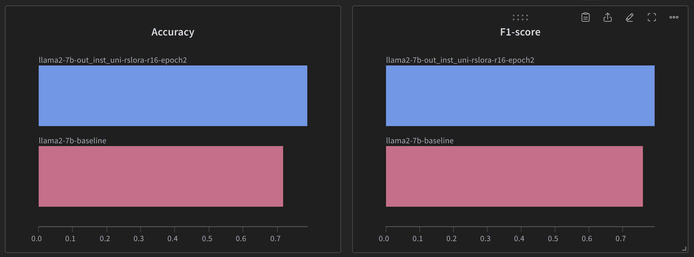

# Response Generator Fine Tuning (SFT)

## Goal

- 讓模型能根據修改版的 prompt 形式進行生成
- 模型生成的回應能符合我們指定的情緒

## Experiment

- 參考 Huggingface 的 [Trl](https://huggingface.co/docs/trl/index) 套件的文件，使用 Supervised Fine Tuning 對 LLM 進行初步訓練

### Environment

- Linux
- Nvidia RTX 3060 12G
- Python >3.11

### Steps

### 1. Choose LLM

- 在進行微調之前，先根據 baseline 的表現來選擇適合此任務的模型
- ## **候選模型**
  - Llama2 7B
  - Mistral 7B
  - Gemma 7B
- 使用模型原生的 prompt template 在多回合對話中產生最後的回應句，並用我們微調的 Sentiment Analysis 模型來分析其情緒。
- 計算回應句情緒和實際對話中的回應情緒對應的 Accuray 和 F1 Score
  
  - 綜合比較兩個指標，可以看出 Llama2 7B 和 Gemma 7B 是相對表現較好的
  - 後續進行模型的試訓練，由於 Gemma 7B 不管用任何方法都無法避免出現 OOM 的情況，故最後選擇 Llama2 7B 作為 base model

### 2. Modify Prompt Template

### 3. Tune Hyperparameters

## Problem

- OOM (Out of Memory)

  - 成因：模型進行 Quantization 後，訓練仍需要使用超過當前 GPU 的記憶體 (12 G)
  - 解方：使用 [Flash Attention](https://github.com/Dao-AILab/flash-attention)
  - 由於 Transformer 架構中注意力分數計算所需的記憶體資源和時間會隨輸入序列的長度而增長，
    而 Flash Attention 使用線性方式來計算注意力分數，
    因此使用 Flash Attention 來替換原本的注意力機制能大幅減低需要的記憶體，且簡化的計算也能加速模型的推理速度。

## Result

