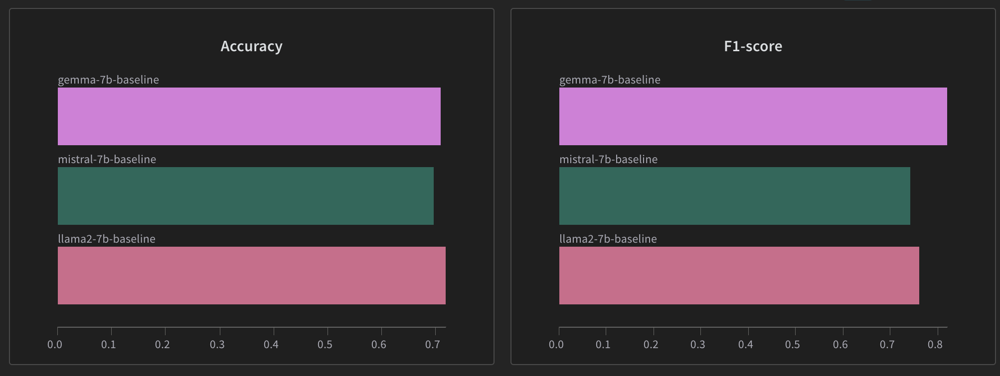

# Response Generator Fine Tuning (SFT)

## Goal

- 讓模型能根據修改版的 prompt 形式進行生成
- 模型生成的回應能符合我們指定的情緒

## Experiment

- 參考 Huggingface 的 [Trl](https://huggingface.co/docs/trl/index) 套件的文件，使用 Supervised Fine Tuning 對 LLM 進行初步訓練

### Environment

- Linux

- Nvidia RTX 3060 12G

- Python >3.11

### Dataset

[Daily Dialog](https://huggingface.co/datasets/li2017dailydialog/daily_dialog)

### Steps

### 1. Choose LLM

- 在進行微調之前，先根據 baseline 的表現來選擇適合此任務的模型

- ## **候選模型**

  - Llama2 7B

  - Mistral 7B

  - Gemma 7B

- 使用模型原生的 prompt template 在多回合對話中產生最後的回應句，並用我們微調的 Sentiment Analysis 模型來分析其情緒。

- 計算回應句情緒和實際對話中的回應情緒對應的 Accuray 和 F1 Score

  

  - 綜合比較兩個指標，可以看出 Llama2 7B 和 Gemma 7B 是相對表現較好的

  - 後續進行模型的試訓練，由於 Gemma 7B 不管用任何方法都無法避免出現 OOM 的情況，故最後選擇 Llama2 7B 作為 base model

### 2. Modify Prompt Template

- 為了配合其他模組的運作，無法採用 sentiment tuning 的方式來調整模型回應的情緒，因此必須在 prompt 中明確指定模型需要產生怎樣情緒的回應。

- 由於 Llama2 7B 和大部分模型的預設 prompt template 都嵌入情緒資訊，所以必須修改原本的 template。

- 原本的 template 基本上是 [INST] {{ user_message }} [/INST] {{ bot_message }} 的形式。
  根據情緒標籤在 prompt 中的位置（ bot_message 在 INST 內還是外）和 tag 的形式（需不需要標出是誰的情緒），
  修改出四個版本的 prompt

  - Tag 不同／在 INST 內 (in_inst)

    ```shell
    [INST] [U_EMOTION] {{ user_emotion }} [/U_EMOTION] {{ user_message }} [C_EMOTION] {{ bot_message }} [/C_EMOTION] [/INST]
    ```

  - Tag 不同／在 INST 外 (out_inst)

    ```shell
    [INST] [U_EMOTION] {{ user_emotion }} [/U_EMOTION] {{ user_message }} [/INST] [C_EMOTION] {{ bot_message }} [/C_EMOTION]
    ```

  - Tag 相同／在 INST 內 (in_inst_uni)

    ```shell
    [INST] [EMOTION] {{ user_emotion }} [/EMOTION] {{ user_message }} [EMOTION] {{ bot_message }} [/EMOTION] [/INST]
    ```

  - Tag 相同／在 INST 外 (out_inst_uni)

    ```shell
    [INST] [EMOTION] {{ user_emotion }} [/EMOTION] {{ user_message }} [/INST] [EMOTION] {{ bot_message }} [/EMOTION]
    ```

- 再次使用資料集生成回應，並計算 Accuracy 和 F1 Score


    - 從以上結果可以看出，將情緒標籤至於 INST 外的組別有比較好的表現

    - 而情緒標籤不同的 prompt 也具有比較好的表現

    - 考量到 prompt template 本身的複雜程度，且實際指標差異僅約 0.03，故選擇 Tag 相同／在 INST 外的組別作為新的 prompt template

### 3. Tune Hyperparameters

> [Report](https://api.wandb.ai/links/hermeschen1116/7erns8gu)

- 綜合參考 Accuray、F1 Score 和生成的文字最後選擇 llama2-7b-out_inst_uni-rslora-r16-epoch2 這組作為訓練完成的模型

## Problem

- OOM (Out of Memory)

  - 成因：模型進行 Quantization 後，訓練仍需要使用超過當前 GPU 的記憶體 (12 G)

  - 解方：使用 [Flash Attention](https://github.com/Dao-AILab/flash-attention)

  - 由於 Transformer 架構中注意力分數計算所需的記憶體資源和時間會隨輸入序列的長度而增長，
    而 Flash Attention 使用線性方式來計算注意力分數，
    因此使用 Flash Attention 來替換原本的注意力機制能大幅減低需要的記憶體，且簡化的計算也能加速模型的推理速度。

## Result


|          | Accuracy           | F1 Score           |
| -------- | ------------------ | ------------------ |
| Final    | 0.7879999876022339 | 0.7950077652931213 |
| Baseline | 0.7179999947547913 | 0.7603256702423096 |
